# Running Small Edge AI Coaches - Cascaded Computer Vision and Small Language Models

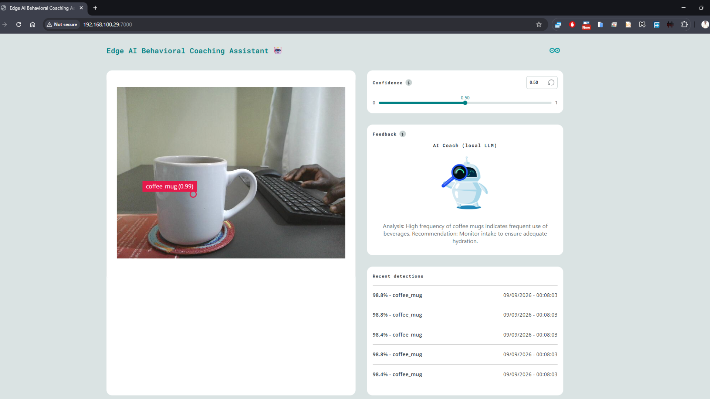

This project demonstrates how we can leverage modern hardware and optimized software such as TinyML models and Small Language Models (SLMs) to create sustainable AI powered behavioral coaching assistants that run on cost effective hardware such as an Arduino UNO Q.

The project uses a perception layer (lightweight object detection) to observe activities and the detections are stored over time into a simple observations list. Afterwards, the system periodically summarizes observations into a simple activity-descriptive text that is provided to an SLM for generating a short behavioral recommendation such as "Drink more water and use coffee less frequently". Summarizing the observation enables us to reduce the amount of information passed to the SLM, reducing the prompt size and computing time.

In this case, the perception and language models serve different roles:

Perception layer (What is happening?) → Behavioral memory layer (Summarize what has been happening over time) → Small Language Model (Provide wellness-based recommendation)

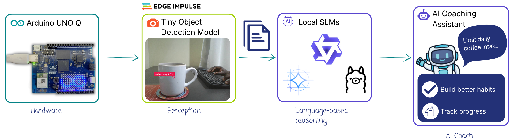

For the current demonstration, the perception layer uses a simple object detection model that can detect a glass of water and coffee mug in an image. Below is an example of the observations summary provided to the SLM. This is embedded in the prompt together with other instructions for the model:
```
Observation period: approximately 60 seconds

Observed activities:
- coffee_mug: 4 observations
- water_mug: 1 observation
```

> [!NOTE]
> I focused on object detection and temporal aggregation of observations count rather than consumption tracking. For example, the application does not determine if a glass of water was picked, consumed and returned with less amount of water. This is the same case for coffee mugs: detecting a mug does not mean that coffee was consumed. The perception model simply detects visible objects and records the observation. In future, there is need for advancing the activity recognition to distinguish the presence of an object and interactions with it.


## Hardware and Software Requirements
### Hardware
- [Arduino® UNO Q](https://store.arduino.cc/products/uno-q): either the 2GB or 4GB variant.
- USB camera
- USB-C® hub adapter with external power
- A power supply (5 V, 3 A) for the USB hub
- Personal computer with internet access

### Software
- Edge Impulse Studio
- Arduino App Lab
- Local Small Language Models available in App Lab:  Qwen, LLama, Gemma

Qwen 3.5 0.8B was used for this project.

## How to Use the Application

First connect a USB-C Hub to the UNO Q. Next, connect a USB webcam to the Hub and power the system through the Power Delivery slot.

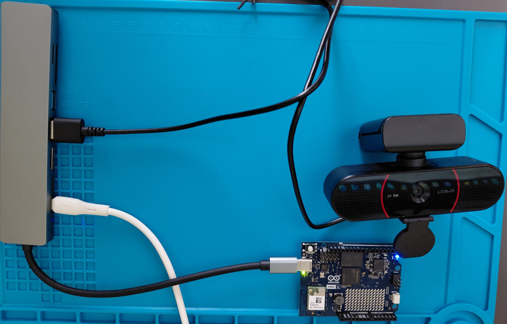

1. SSH into your UNO Q and clone the GitHub repository into the ```/home/arduino/ArduinoApps/``` directory:
```
git clone https://github.com/SolomonGithu/ai-behavioral-coaching-assistant.git
```

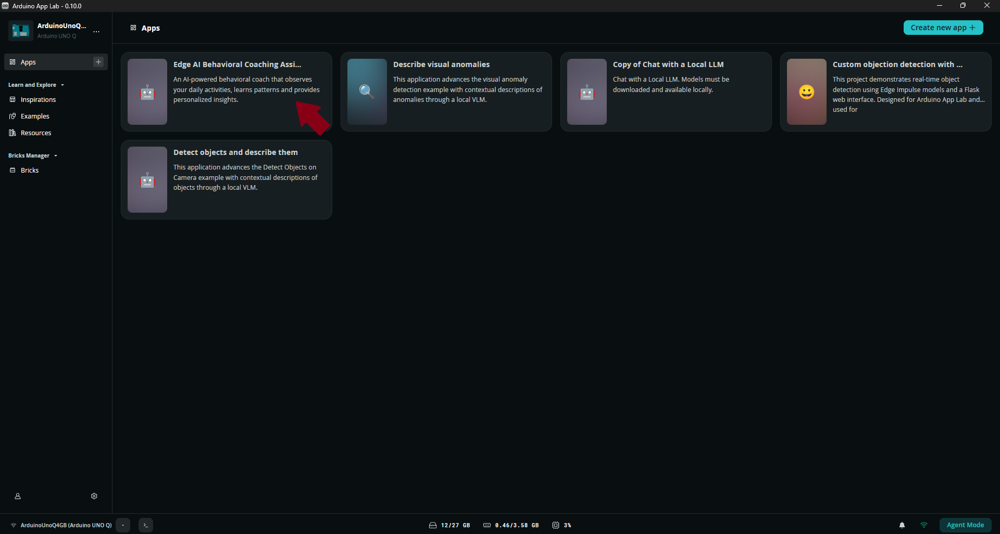

2. Train a small perception model and select it from the corresponding AI brick in App Lab.  You can train one on [Edge Impulse](https://www.edgeimpulse.com/). This model can be tailored for different use cases: image classification, object detection, sound classification, anomaly detection, etc. Feel free to follow this [tutorial](https://www.youtube.com/watch?v=X-GBxtfEP-8) on loading custom models to App Lab. Alternatively, you can also manually load models as shown in [this project](https://www.hackster.io/sologithu/running-local-vlms-on-arduino-uno-q-with-the-app-lab-70e8e3#toc-step-3--copy-tinyml-model-to-uno-q-3). 

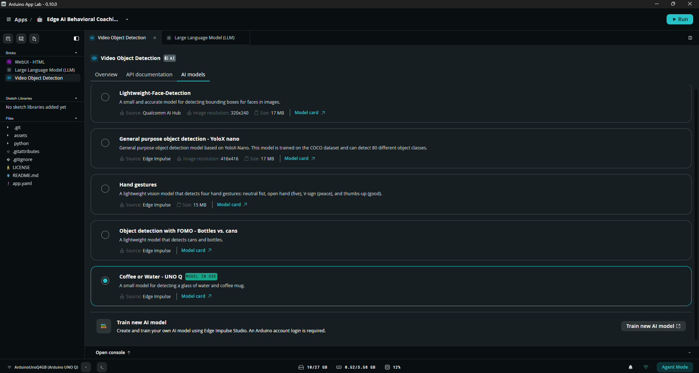

3. In App Lab, click the Large Language Model (LLM) brick and navigate to the 'AI models' tab. Download and select one of the available models. For this project, I used Qwen 3.5 0.8B because it is relatively small and will be faster to get a response from it. Other supported models can also be used depending on your hardware and use case.

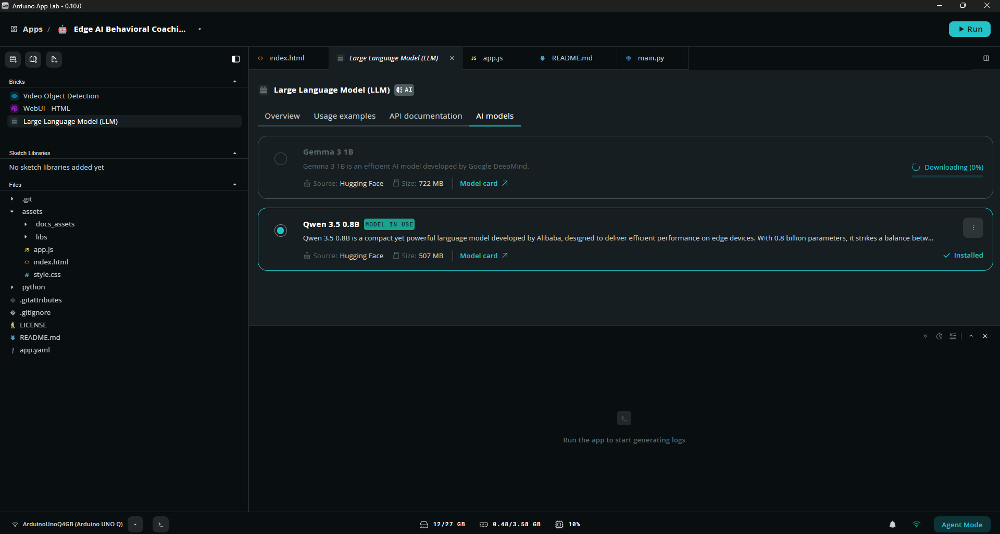

4. Finally, start the application with the 'Run' button. Running the application for the first time will take some seconds since the system needs to download the necessary Docker images. Once this is finished the application's container will be started and the Web UI will automatically open in a browser. You can also open the Web UI manually in a browser by setting URL to the local IP address of your Arduino UNO Q and port 7000.

Once the app is running, it will:
- Capture frames from the USB camera.
- Run the selected Edge AI perception model (in my case it is an object detection model).
- Display the detected objects in the Web UI.
- Store observations as behavioral events for the defined duration (```AI_COACHING_INTERVAL_SECONDS``` variable in main.py)
- Periodically summarize observations.
- Provide the observations summary to the local language model. *In my setup, response time from the SLM was around 60 seconds, peak CPU utilization was approximately 95% while RAM consumption was 1.25GB out of the available 3.58GB.*
- Display the generated behavioral analysis and recommendation in the AI Coach interface.

## Results

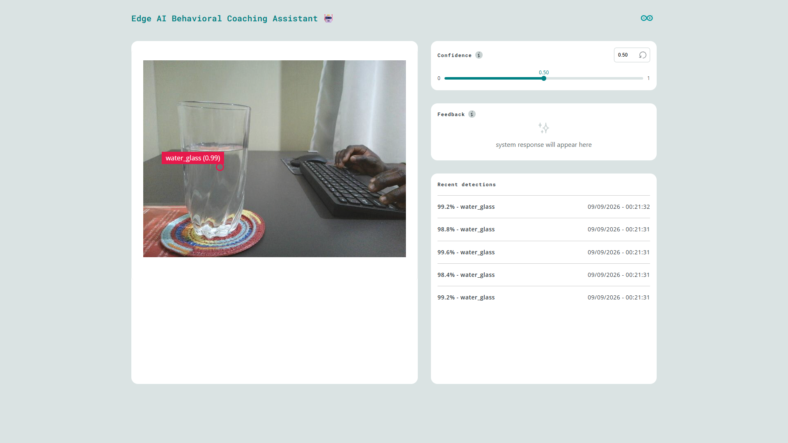

1. Glass of water frequently detected:
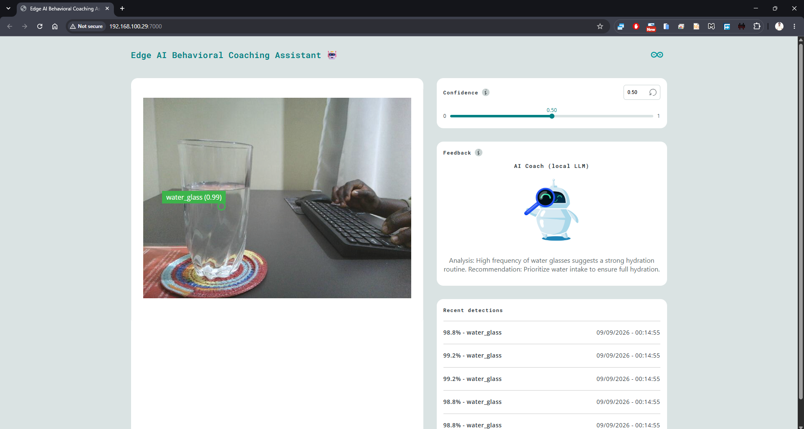

2. Coffee mug is detected more frequently than glass of water:
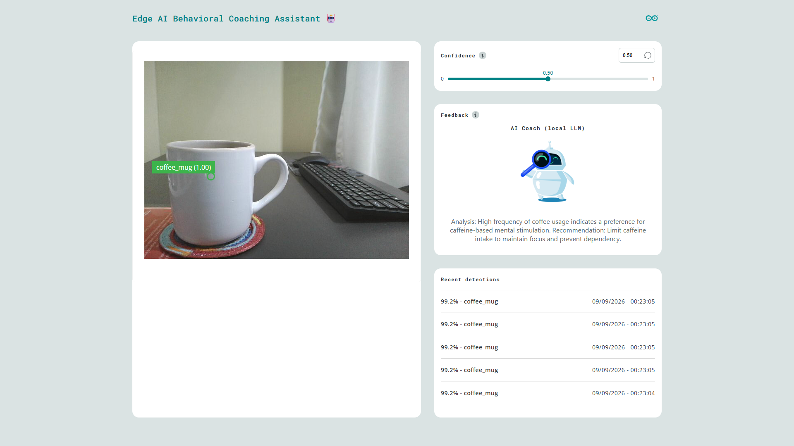

3. Coffee or water?
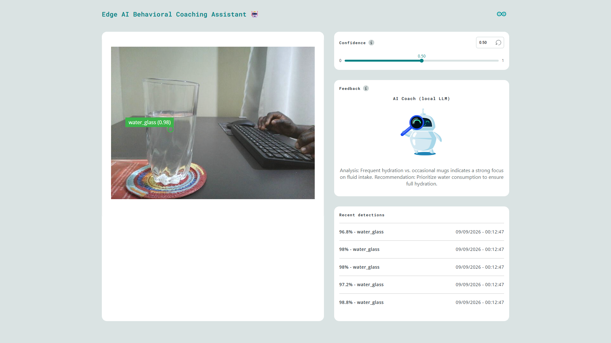

4. System logs:
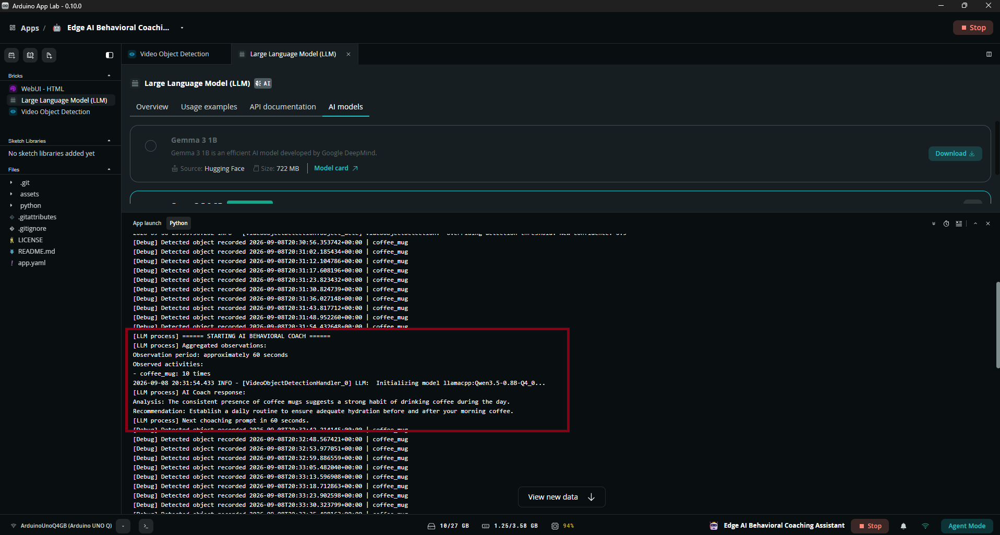

